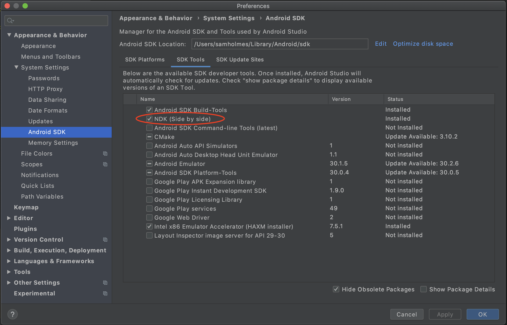

# Edge Wallet

## A multicurrency mobile wallet for Bitcoin, Bitcoin Cash, Ethereum, Dash, Litecoin, Ripple/XRP and Monero

Edge Wallet is:

- simple
- secure
- private
- decentralized
- multi-currency
- cross-platform
- mobile first
- open source

---

## Requirements

Edge is known to build with this exact tool set. Updated versions of these toolsets may break the build or app. If you have issues, try mirroring these exact versions.

- macOS Catalina 10.15.6
- Xcode 12.1
- Android Studio 4.1
- CocoaPods 1.10.0
- Android NDK r21d
- NodeJS 14.15.0
- NPM 6.14.8
- Yarn 1.22.10
- Java 1.8.0_202

## Getting Started

### Install NodeJS & NPM

    https://nodejs.org/en/download/

### Install Yarn

    https://yarnpkg.com

### Install React Native CLI

    npm install -g react-native-cli

### Install CocoaPods (macOS)

    sudo gem install cocoapods

### Checkout develop branch & install node_modules

    cd edge-react-gui
    yarn

### XCode Setup - Use Legacy Build System

    Open edge-react-gui/ios/edge.xcworkspace in Xcode
    File -> Workspace Settings
    Set `Build System` to `Legacy Build System`

### Android NDK Setup

Use Android Studio's Preferences to install NDK (Side by side):

1. Open Preferences
2. Navigate to `Appearance & Behavior -> System Settings -> Android SDK` in the sidebar
3. Navigate to `SDK Tools` tab
4. Check `NDK (Side by side)` checkbox
5. Click OK or Apply and follow the download instructions.

> If the NDK is already installed from Android Studio, it should be in `/Users/[user]/Library/Android/sdk/ndk-bundle` (macOS) or `C:\Users\[username]\AppData\Local\Android\Sdk\ndk-bundle` (Windows).

### Set the following environment vars

The following environment variables should be exported from your `.bashrc` or equivalent file.

    export ANDROID_NDK_HOME=/Users/[username]/Library/Android/sdk/ndk-bundle
    export NDK_HOME=/Users/[username]/Library/Android/sdk/ndk-bundle
    export SDK_HOME=/Users/[username]/Library/Android/sdk
    export ANDROID_HOME=/Users/[username]/Library/Android/sdk
    export JAVA_HOME="/Applications/Android Studio.app/Contents/jre/jdk/Contents/Home"

### Android Recommended Versioning & Configuration

For best results, please consider using the following versions (up-to-date as of 2020-11-16)

- **Java 8 & Java JDK** version 8u202 (([link](https://www.oracle.com/java/technologies/javase/javase8-archive-downloads.html)))

### Add API key in env.json

A public API key is built into the edge-core-js which can be used to build and test the Edge app. This key is severely rate limited and should not be used for production. For production use, get an API key by emailing info@edge.app.

Copy the `env.example.json` to `env.json` and change the `AIRBITZ_API_KEY` to the API key you received from Edge. To use the public API key, leave `AIRBITZ_API_KEY` blank.

### Run the app in debug mode

#### iOS

- Open `edge-react-gui/ios/edge.xcworkspace` in Xcode
- Choose a target device or simulator and tap the Play button on the top nav bar

#### Android

    cd android
    ./gradlew assembleDebug

- The resulting APK will be in `./app/build/outputs/apk/debug/app-debug.apk`
- Copy the APK to a simulator like Genymotion or a real device via Email or messaging app

### Build release version of app

First, run `./scripts/updateVersion.js` to copy the `package.json` version into the native project files, and to assign a unique build number.

#### iOS

- Open `edge-react-gui/ios/edge.xcworkspace` in Xcode
- Hold [ option/alt ] and click on the Edge button on the top bar to the right of the Play and Stop icons.
- Change 'Build Configuration' to Release
- Uncheck 'Debug Executable'
- Close window
- Choose a device and hit Play

#### Android

    cd android
    ./gradlew assembleRelease

- The resulting APK will be in `./app/build/outputs/apk/release/app-release.apk`
- Copy the APK to a simulator like Genymotion or a real device via Email or messaging app

---

## Deploying (macOS Only)

The included `deploy.js` is a script to automate building, signing, and deploying release builds of Edge. It provides the following:

- Auto sign Android APK with Android keystore files
- Auto sign iOS IPA with provisioning profiles

### To Use

- Run `./scripts/updateVersion.js` to set up your build number & version.
- Set the env var KEYCHAIN_PASSWORD to the keychain password of the current user
- Copy the `deploy-config.sample.json` to `deploy-config.json` and edit the parameters accordingly. You'll need a HockeyApp account to get ids and keys
- Put any Android keystore files into `edge-react-gui/keystores/`
- If using Firebase, put your account's `google-services.json` and `GoogleService-Info.plist` into `edge-react-gui/`
- Install xcpretty `sudo gem install xcpretty`

Run deploy

    ./deploy.js edge ios master
    ./deploy.js edge android master

---

## Debugging

For debugging, we recommend using [React Native Debugger](https://github.com/jhen0409/react-native-debugger). The current latest version (0.11) works well.

### Installation

You can download React Native Debgger 0.10.11 at
[https://github.com/jhen0409/react-native-debugger/releases/tag/v0.10.11](https://github.com/jhen0409/react-native-debugger/releases/tag/v0.10.11).

#### Debugging in iOS Simulator

    ⌘ + d (command + d)
    Select "Debug JS Remotely"

#### Debugging in Android Emulator (GenyMotion / Android Studios)

    ⌘ + m (command + m)
    Select "Debug JS Remotely"

## Contributing

Please follow the coding conventions defined in [Edge Conventions](https://github.com/Airbitz/edge-conventions)
